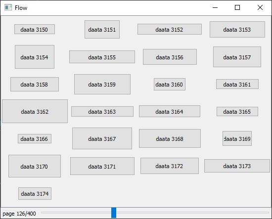
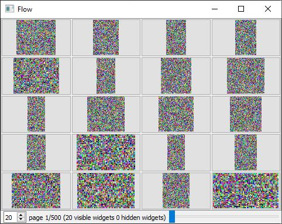

# qt-widgets

Reusable Qt widgets library.

## Flow Widget

Automatic layout for similar objects.



```python
model: List[str] = [f'data {_}' for _ in range(10_000)]

flow = FlowWidget(
    config=FlowConfig(
        item=Item(
            # width=200,
        ),
        page=Page(
            index=4,
            size=25
        ),
    ),
    builder=lambda item: QPushButton(item),
    model=model,
)
```

# Galery Widget

Based on Flow Widget with auto-resize behavior.



```python
def builder(path: str):
    def reader() -> numpy.ndarray:
        return cv2.imread(path)

    return reader


widget = GaleryWidget(
    images=[
        builder('image1.jpg'),
        builder('image2.jpg')
    ],
    config=FlowConfig(
        page=Page(size=20)
    )
)
```

# Install

```
pip install qt-widgets
```

## Requirements

PyQt5

```
pip install pyqt5
pip install pyqt5-tools
```

## Usage

Run any script from the [test folder](tests).
